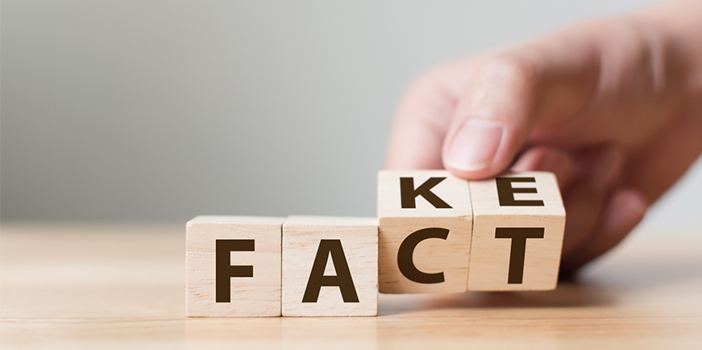
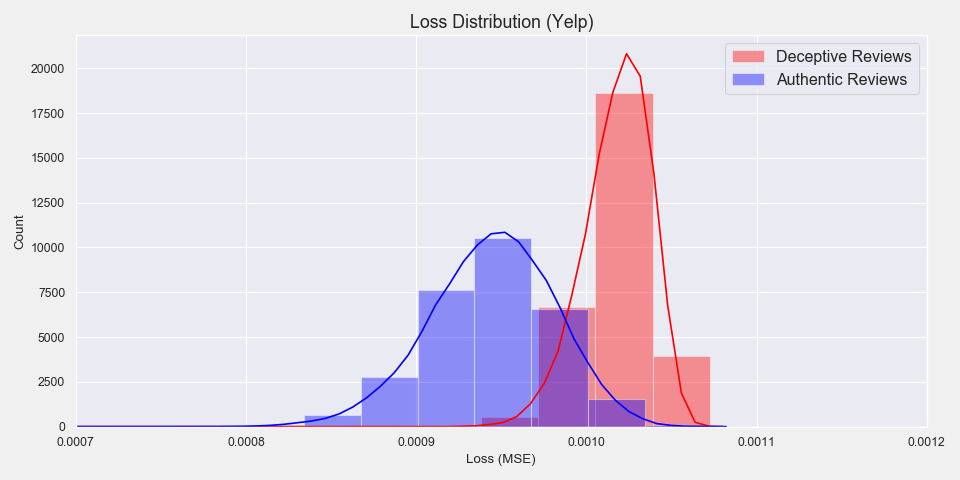
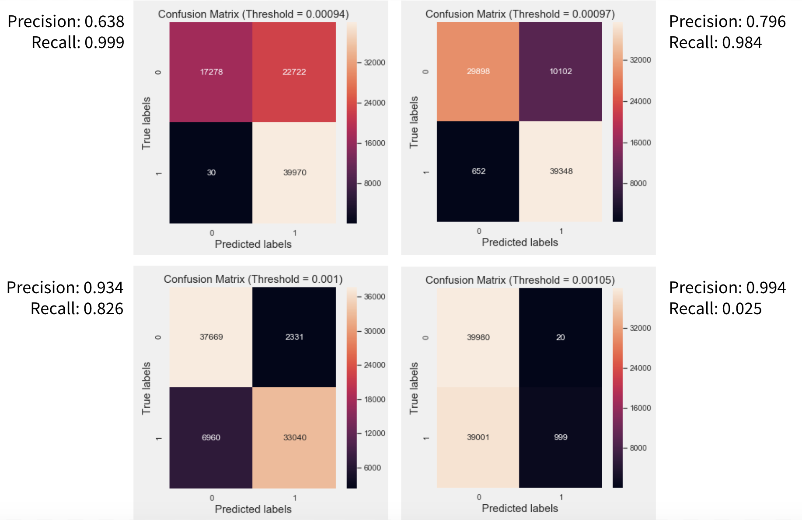
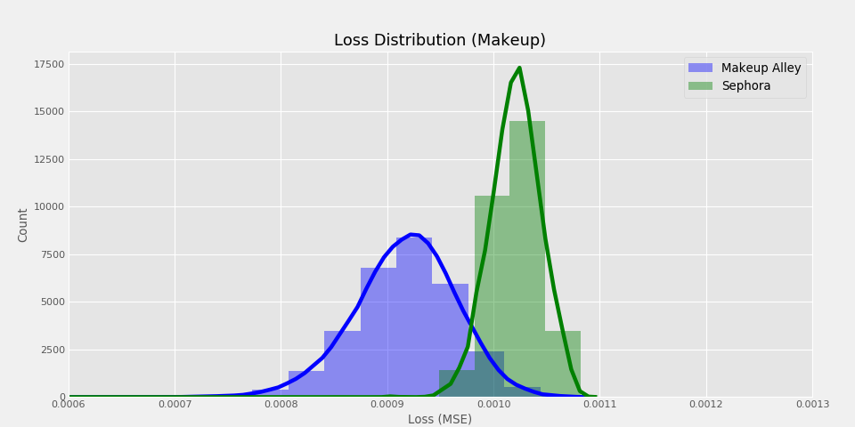
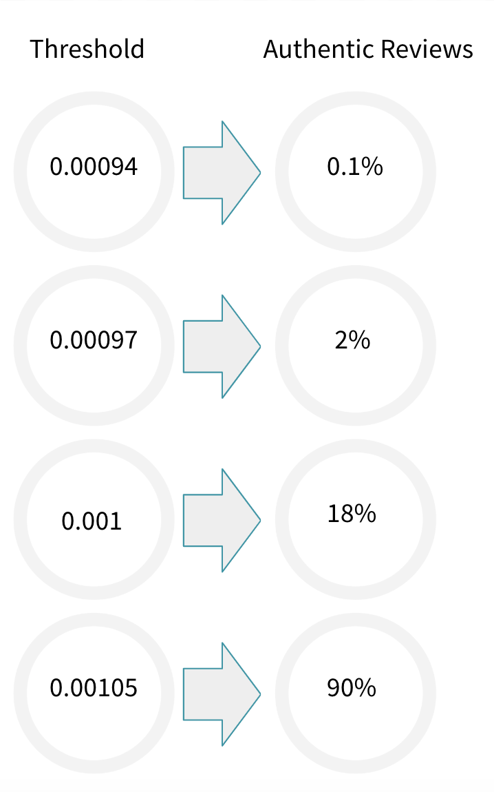
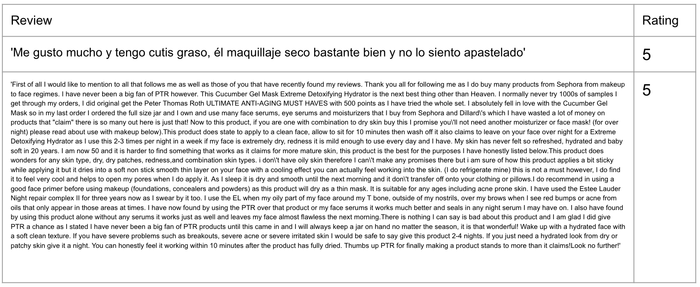

# What's on Your Face...FakeOrFact

 

    
    

Presentation link: https://docs.google.com/presentation/d/1R_a06wiNli2U6VWdJesA7fPcBYRkzlSy-pXg5CKK1ZI/edit?usp=sharing

**MOTIVATION** 

This project is a continuation from my previous project, What's on Your Face... Be Honest( https://github.com/suchayarj/WhatsOnYourFace...BeHonest), where I utilized One-Class SVM to identify fake reviews on Sephora. The only apparent difference from Fake and Authentic reviews from last project was the length of the review. I am attempting to improve the model's performance by utilizing Autoencoder Neural Network (MLP) for anomaly detection and include rating feature as well.

It's important for both business and consumer sides to be able to identify deceptive and authentic reviews. Consumer never knows if business hire anyone to write good reviews or business' competitors might discredit them by writing deceptive reviews. On the other hands, to build an honest brand image, business side needs make sure that all their reviews are genuine. If they hire someone to write fake reviews, the truth will reveal sooner or later (SundayRiley's case for example)

**DATASET**

- Dataset used to train and evaluate the model 
    - **Yelp Review Dataset** from https://github.com/zzhang83/Yelp_Sentiment_Analysis. The reviews had been labeled to True & Deceptive. This dataset is needed in order to train, tune, and evaluate my model since I will be using neural network and I need to assure that my model works with labeled data first.

- Makeup dataset
    - **Training set** : creating my own dataset by performing a webscaping from www.makeupalley.com utilizing BeautifulSoup. The dataset consists of approximately 230,000 entries. I am treating reviews from this website as **authentic** class since this website's sole purpose is for beauty community to share opinions and it's widely known for its honest reviews
    - **Testing set**: I am combining 2 existing Sephora Skincare Review datasets found on Github (https://github.com/nanafwu/sephora-reviews-nlp/blob/master/data/sephora_review.csv and https://github.com/anselsantos/sephora_scrapy/blob/master/the-ordinary_reviews.csv) These are reviews scraped from from www.sephora.com. Reviews from Sephora are more diverse. It consists of both authentic and fake.

**EDA(Recap)**
- Ratings:
    Sephora has average rating of approximately 4.3, while Makeup Alley has lower average at around 3.7. 70% of the rating on Sephora were 5 stars, which could be an indicator of fake reviews. On the other hand, Makeup Alley rating distribution seems more fair and authentic, with 4 stars being around 40%, while 2, 3, and 5 stars are about the same portion.

  

- Review:
Reviews on make up Makeup Alley tends to be longer than Sephora. The median of MA reviews is roughly 400-500 words per review, while Sephora's median is roughly 300 words per review
     

    
    

**MODELING - Anomaly Detection with MLP Autoencoder**

 Since I have dataset on only one class (Authentic), anomaly detection is the most appropriate method. I am also using mean square error as loss function because I am trying to reproduce the input using Autoencoder where it aims to minimize the MSE. 
 
 The main idea of anomaly detection is that if the loss of the input data (review & rating) is higher than the threshold, then it's considered as anomaly (or Fake review in this case)

Modeling workflow:
- Create autoencoder nueral network MLP model 
- Run model multiple times with different parameters (Activation, Loss, Optimizer) and layers
    - In my case, the loss value is very low. No matter how much I tuned the parameter or how many layers I used, the loss values are almost identical. So, I ended up choosing a simple model for efficiency.
- Train the mode with authentic Yelp reviews 
- Evaluate the loss (MSE) for the authentic Yelp reviews and deceptive reviews
- Plot the loss distribution to see how different Authentic/Deceptive reviews are and also to determine the anomaly threshold.

 

    
    

**Picking Threshold**
- After plotting the loss distribution, I can set anomaly threshold at different values. I picked 4 threshold values from the overlapping area and created confusion matrices.
- Business can pick the threshold that is suitable for the type of problems they are solving. 

 

Precision-Recall
 

In this case, I choose to minimize the False Negative as much as possible so that all anomalies are being classified as Fake. Therefore, I chose the threshold at 0.00094 where the loss distribution of deceptive review roughly starts.

**Training model with makeup dataset**
- Now that I have the model and possible thresholds I can use, I can start training the model with Makeup Alley dataset
- Evaluate the loss for the authentic Makeup reviews and Sephora reviews
- Plot loss distribution for Makeup Alley and Sephora

Note: I find that Sephora loss distribution is so different from Makeup Alley and make it seems as though Sephora reviews are mostly fake. It could be because of overfitting of Makeup Alley data, text pre-processing problems, and small size of Sephora dataset which makes it less diverse. So, I will try the following:
- Adjust text pre-processing, stopwords, and vectorization for reviews
- Test on bigger Sephora reviews dataset

However, I will use this information to get some possible results for now.

**RESULTS**

I set different thresholds for Sephora reviews and got the following results.

As you can see from the image above, only 0.1% of Sephora reviews are classified as authentic when the threshold is set at 0.00094, and so on.

Examples of Sephora reviews that are classified as Authentic with threshold 0.00094

From the review samples above, it's apparent that the length of the review is no longer the classifier.

**MORE FUTURE WORK**
- Obtain more Sephora data. Once it is obtained, I would like to evaluate the reviews by brands, especially on Sunday Riley who had scandals about fake reviews.
- Build Anomaly detection with RNNs LSTM.
    - LSTM might improve the performance since it has a memory that captures what have been calculated so far, which is ideal for text & speech analysis
- Work on creating Google Chrome Extension where Sephora web users can see if reviews they are looking at are authentic or not based on my machine learning model

**DIRECTORY**
- src/ : contains py files with functions for the following purposes.
    - combine_sephora_data.py :  to combine 2 existing Sephora datasets obtain from Github
    - CleanText.py : to pre-process review texts
    - ModelYelp.py : to model Yelp data with Neural Network MLP Autoencoder for anomaly detection
    - ModelMakeup.py : to model Makeup data with Neural Network MLP Autoencoder for anomaly detection
    - webscrape-makeupalley.py : to webscrape skincare reviews from MakeupAlley.com
- img/ : contains graphs and images 
- data/ : contains samples of data used in this project 

