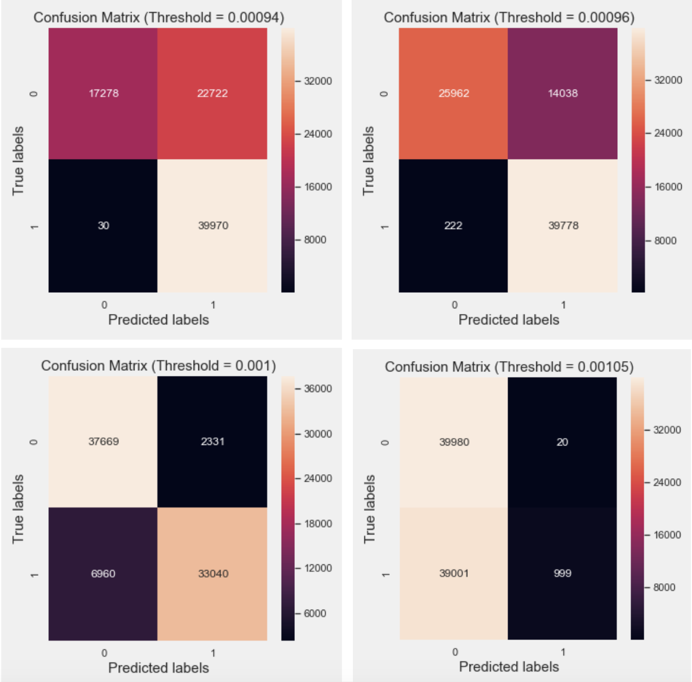
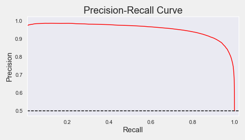

# What's on Your Face...FakeOrFact

 

    
    

Presentation link: https://docs.google.com/presentation/d/1R_a06wiNli2U6VWdJesA7fPcBYRkzlSy-pXg5CKK1ZI/edit?usp=sharing

**DIRECTORY**
- src/ : contains py files with functions for the following purposes.
    - CleanText.py : review text pre-processing
    - Model.py : to model using Neural Network MLP for anomaly detection
    - webscrape-makeupalley.py : to webscrape skincare reviews from MakeupAlley.com
- img/ : contains graphs and images 
- data/ : contains samples of data used in this project 

**MOTIVATION** 

This project is a continuation from my previous project, What's on Your Face... Be Honest( https://github.com/suchayarj/WhatsOnYourFace...BeHonest), where I utilized One-Class SVM to identify fake reviews on Sephora. The only apparent difference from Fake and Authentic reviews from last project was the length of the review. I am attempting to improve the model's performance by utilizing Autoencoder Neural Network (MLP) for anomaly detection and include rating feature as well.

It's important for both business and consumer sides to be able to identify deceptive and authentic reviews. Consumer never knows if business hire anyone to write good reviews or business' competitors might discredit them by writing deceptive reviews. On the other hands, to build an honest brand image, business side needs make sure that all their reviews are genuine. If they hire someone to write fake reviews, the truth will reveal sooner or later (SundayRiley's case for example)

**DATASET**

- Dataset used to train and evaluate the model 
    - **Yelp Review Dataset** from https://github.com/zzhang83/Yelp_Sentiment_Analysis. The reviews had been labeled to True & Deceptive. This dataset is needed in order to train, tune, and evaluate my model since I will be using neural network and I need to assure that my model works with labeled data first.

- Makeup dataset
    - **Training set** : creating my own dataset by performing a webscaping from www.makeupalley.com utilizing BeautifulSoup. The dataset consists of approximately 230,000 entries. I am treating reviews from this website as **authentic** class since this website's sole purpose is for beauty community to share opinions and it's widely known for its honest reviews
    - **Testing set**: I am combining 2 existing Sephora Skincare Review datasets found on Github (https://github.com/nanafwu/sephora-reviews-nlp/blob/master/data/sephora_review.csv and ) These are reviews scraped from from www.sephora.com. Reviews from Sephora are more diverse. It consists of both authentic and fake.

**EDA(Recap)**
- Ratings:
    Sephora has average rating of approximately 4.3, while Makeup Alley has lower average at around 3.7. 70% of the rating on Sephora were 5 stars, which could be an indicator of fake reviews. On the other hand, Makeup Alley rating distribution seems more fair and authentic, with 4 stars being around 40%, while 2, 3, and 5 stars are about the same portion.

  

- Review:
Reviews on make up Makeup Alley tends to be longer than Sephora. The median of MA reviews is roughly 400-500 words per review, while Sephora's median is roughly 300 words per review
     

    
    

**WORKFLOW**
- Clean review text, tokenize, stem, vectorize 
- Incorperate rating feature into the model
- Test model on Yelp reviews where the labels are available (True/Deceptive)
- Tune model
- Apply the model on MakeupAlley and Sephora dataset

**MODELING - Anamoly Detection with MLP Autoencoder**
- Since I have dataset on only one class, anomaly detection is the most appropriate method. I'm detecting anomaly by the mean squared error loss. If the loss is higher than the threshold, then it's classified as Fake/Deceptive reviews
- Create autoencoder MLP model to detect anomaly with the use of sequential information 
    - Loss Function: Mean Squared Error. Since we are trying to reproduce the input with  this model. The model will tryto minimize the MSE
- Fit the model with authentic Yelp reviews training set
- Evaluate the loss for the authentic Yelp reviews and deceptive reviews
- Plot the loss distribution to determine the anomaly threshold for Authentic/Deceptive reviews

 

    
    

The graph above shows the loss distribution of Authentic Reviews and Deceptive Reviews from Yelp Dataset

Picking Threshold
- Business can pick threshold that suitable for the type of problems they are solving. 

- Setting anomaly threshold at different values according to the loss distribution above
 

Precision-Recall
 

In this case, I choose to minimize the False Negative as much as possible so that all anamolies are being classified as Fake. Therefore, I chose the threshold at 0.00094 where the loss distribution of deceptive review starts.

**FUTURE WORK**
- Anomaly detection with RNNs LSTM.
    - LSTM might improve the performance since it has a memory that captures what have been calculated so far which is ideal for text & speech analysis

- Test on bigger dataset of Sephora reviews and classify the reviews by brands

- I am working on creating Google Chrome Extension where website users can see if reviews they are looking at are authentic or not based on my machine learning model

